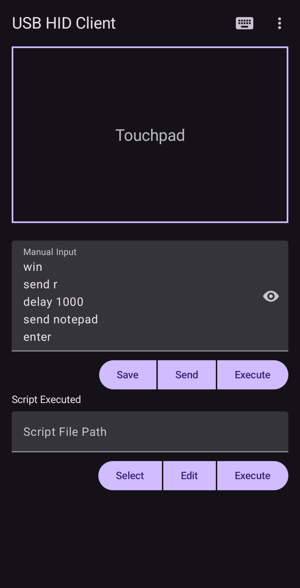
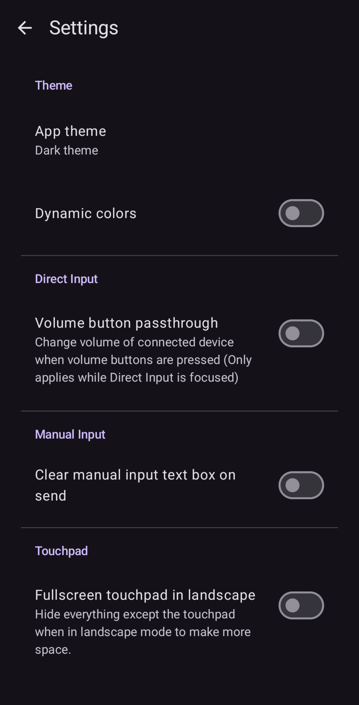
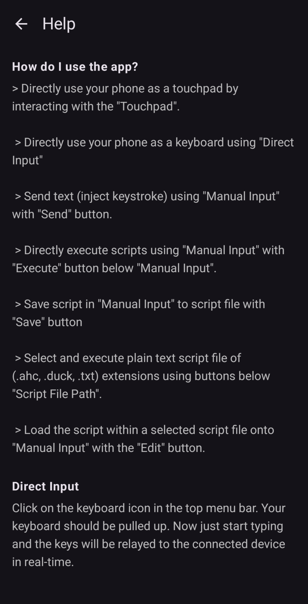
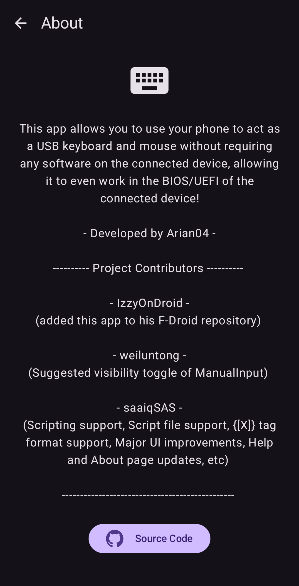

<div id="top"></div>

<!-- PROJECT SHIELDS -->
[![Contributors][contributors-shield]][contributors-url]
[![Forks][forks-shield]][forks-url]
[![Stargazers][stars-shield]][stars-url]
[![Issues][issues-shield]][issues-url]
[![GPL-3.0 License][license-shield]][license-url]
<br />
[![IzzyOnDroid Repo Version][izzyondroid-shield]][izzyondroid-url]

<!-- PROJECT LOGO -->
<br />
<div align="center">
  <a href="https://github.com/Arian04/android-hid-client">
    
  </a>

<h3 align="center">USB HID Client</h3>
  <p align="center">
    Android app that allows you to easily use your phone as a keyboard and mouse
    <br />
    <br />
    <a href="https://github.com/Arian04/android-hid-client/issues">Report Bug</a>
    ·
    <a href="https://github.com/Arian04/android-hid-client/issues">Request Feature</a>
  </p>
</div>


<!-- TABLE OF CONTENTS -->
<details>
  <summary>Table of Contents</summary>
  <ol>
    <li>
      <a href="#fork-updates">Fork Updates</a>
    </li>
    <li>
      <a href="#about-the-project">About The Project</a>
    </li>
    <li>
      <a href="#getting-started">Getting Started</a>
      <ul>
        <li><a href="#prerequisites">Prerequisites</a></li>
      </ul>
    </li>
    <li><a href="#usage">Usage</a></li>
    <li><a href="#roadmap">Roadmap</a></li>
    <li><a href="#contributing">Contributing</a></li>
    <li><a href="#license">License</a></li>
    <li><a href="#acknowledgments">Acknowledgments</a></li>
  </ol>
</details>

## Fork Updates
This project is originally forked from v3.0.1 of the [Arian04/android-hid-client](https://github.com/Arian04/android-hid-client). 

**Latest App Release for this fork: [v3.0.1_saaiqsas_8](github.com/saaiqSAS/android-hid-client/releases/tag/v3.0.1_saaiqsas_8)**

</br>

The following updates have been made in this fork:
- **Scripting Support:** Added scripting functionality for enhanced automation and control.

- **Script File Support:** Added support for plaintext script files with the extensions `.ahc`, `.duck`, and `.txt`.

- **Additional Script Features:** Including the ability to Save, Edit scripts.

- **Special/Modifier Key Support for Manual Input:** Introduced `{[X]}` tag format to allow special or modifier keys to be passed in Manual Input mode.

- **Manual Input Visibility Toggle:** Added a toggle to change visibility in Manual Input (Issue [#51](https://github.com/Arian04/android-hid-client/issues/51), by [weiluntong](https://github.com/weiluntong)).

- **Updated Help Page:** Revised the help page to provide details on the newly added features.

- **Updated About Page:** Updated the About page to show the developer, contributors, license, and app version.

- **Major UI Improvements:** Mainpage layout arrangement changed, multiple pages made scrollable.

</br>

> **Note:** Details on scripting and the `{[X]}` tag format will be provided in the **Help page** of the app. Furthermore, the screenshots in this fork (under "About The Project") are updated to show the latest app version of this fork

</br>

**Example 1: To open notepad in Windows using Scripting**
>  ```
>  // This is a comment
>  WIN
>  SEND r
>  SLEEP 1000
>  SEND notepad
>  ENTER
>  ```
>  ```
>  REM This is a comment
>  META
>  STRING r
>  DELAY 1000
>  STRINGLN notepad
>  ```
>  Multiple command/key variations are available for a single function or key. The above scripts can be either executed from a script file or directly from Manual Input with the corresponding **Execute** button.

</br>

**Example 2: To open notepad in Windows using `{[X]}` tag** with Manual Input
>  ``` 
>  {[M]}r{[ ]}{[ ]}notepad{[N]}
>  ```
> This string should be send via the **Send** button in Manual Input.

</br>
</br>

<!-- ABOUT THE PROJECT -->

## About The Project

[](v8_screenshot_2.png) 
[](v8_screenshot_3.png) 
[](v8_screenshot_4.png) 
[](v8_screenshot_5.png) 

This Android app allows you your phone to present itself to a connected device as a keyboard and mouse.
Since this happens at a very low level, the connected device sees it exactly as a normal keyboard and mouse, meaning
you don't need to install any software on the connected computer! For this reason, it will even work if the
connected device is in its BIOS/UEFI. Even multimedia keys are supported, meaning you can send volume up/down
keys to the connected computer to control media.

**Disclaimers**:

- This app requires your device to be rooted.
- I strongly recommend using a keyboard such as [Unexpected Keyboard](https://github.com/Julow/Unexpected-Keyboard) to
  use special keys such as modifier and function keys, but most functionality will work with any standard Android
  keyboard.

Bonus description for nerds: This app adds (and provides a simple UI for you to communicate with) two character
devices (`/dev/hidg0` and `/dev/hidg1` respectively) by
adding HID functions to the default Android USB gadget. If you wanted to, you could just use this app to create the
character devices, then
communicate solely through some C program, shell script, or whatever else you wanted as long as it had the right
permissions to access the
character devices and knew how to send proper reports to them. Beware of SELinux policies if you do that though. If
anyone is actually doing that, let
me know, I'd be glad to help if necessary.

Tested primarily on: Linux (Host computer) and Pixel 5 running Android 14.

<p align="right">(<a href="#top">back to top</a>)</p>


<!-- GETTING STARTED -->

## Getting Started

### Prerequisites

* Rooted device running Android
    - Only specific root methods are supported, because I need to patch SELinux policy at runtime and am using provided
      tools to do so.
      if your root method isn't on this list and provides a method for live-patching SELinux policy, feel free to create
      an issue.
        - Magisk: `magiskpolicy`
        - KernelSU: `ksud sepolicy patch`
    - Android version that I currently test with: 14
* Soft Keyboard
    - I test the app with Gboard and Unexpected Keyboard, but Unexpected Keyboard is the one with slightly better
      support, more keys,
      and [fewer issues](https://github.com/Arian04/android-hid-client/issues?q=label%3A"soft+keyboard+issue").

### Installation (Binary)<a name="installation-binary"> </a>

The recommended way to install the app is through the [IzzyOnDroid repo][izzyondroid-url] via an app
that's compatible with F-Droid style repositories, since that'll make updates much easier. However, you can also
download
the APK file from the [Github releases page](https://github.com/Arian04/android-hid-client/releases), then install it
on your Android device.

### Installation (Source)<a name="installation-source"></a>

Clone the repository.

   ```sh
   git clone https://github.com/Arian04/android-hid-client.git
   ```

import into [Android Studio](https://developer.android.com/studio), build the APK, then install it
on your Android device.

<p align="right">(<a href="#top">back to top</a>)</p>

<!-- USAGE EXAMPLES -->

## Usage

To relay keys in real-time as soon as you press them, click on the keyboard icon in the menu bar. It should pull up your
keyboard. Now you can just start typing!

Typing in the "Manual Input" text box will send all the characters that you've typed into the box to
the connected device once you hit the "send" button.

### Some Use Cases

* Quickly be able to change BIOS/UEFI settings of a computer when you don't have a keyboard with you
* Typing a long string (such as a password or IP address) into a console

<p align="right">(<a href="#top">back to top</a>)</p>


<!-- ROADMAP -->

## Roadmap

- [X] Keyboard support
- [ ] Add some special key buttons to the UI (like multimedia keys)
- [X] Touchpad support
- [X] Ability to send string all at once
- [X] Add full settings page
- [X] Add prompt to create /dev/hidgX if not present

See the [open issues][issues-url] for a full list of proposed features (and known issues).

<p align="right">(<a href="#top">back to top</a>)</p>


<!-- CONTRIBUTING -->

## Contributing

Contributions are what make the open source community such an amazing place to learn, inspire, and create. Any
contributions you make are **greatly appreciated**.

If you have a suggestion that would make this better, please fork the repo and create a pull request. You can also
simply open an issue with the tag "enhancement".
Don't forget to give the project a star! Thanks again!

1. Fork the Project
2. Create your Feature Branch (`git checkout -b feature/AmazingFeature`)
3. Commit your Changes (`git commit -m 'Add some AmazingFeature'`)
4. Push to the Branch (`git push origin feature/AmazingFeature`)
5. Open a Pull Request

<p align="right">(<a href="#top">back to top</a>)</p>


<!-- LICENSE -->

## License

Distributed under the GNU GPLv3 License. See `LICENSE.txt` for more information.

<p align="right">(<a href="#top">back to top</a>)</p>


<!-- ACKNOWLEDGMENTS -->

## Acknowledgments

* [IzzyOnDroid](https://floss.social/@IzzyOnDroid) for adding this app
  to [his F-Droid repository](https://android.izzysoft.de/repo)
* [Best-README-Template](https://github.com/othneildrew/Best-README-Template)

<p align="right">(<a href="#top">back to top</a>)</p>


<!-- MARKDOWN LINKS & IMAGES -->
<!-- https://www.markdownguide.org/basic-syntax/#reference-style-links -->

[contributors-shield]: https://img.shields.io/github/contributors/Arian04/android-hid-client.svg?style=for-the-badge

[contributors-url]: https://github.com/Arian04/android-hid-client/graphs/contributors

[forks-shield]: https://img.shields.io/github/forks/Arian04/android-hid-client.svg?style=for-the-badge

[forks-url]: https://github.com/Arian04/android-hid-client/network/members

[stars-shield]: https://img.shields.io/github/stars/Arian04/android-hid-client.svg?style=for-the-badge

[stars-url]: https://github.com/Arian04/android-hid-client/stargazers

[issues-shield]: https://img.shields.io/github/issues/Arian04/android-hid-client.svg?style=for-the-badge

[issues-url]: https://github.com/Arian04/android-hid-client/issues

[license-shield]: https://img.shields.io/github/license/Arian04/android-hid-client.svg?style=for-the-badge

[license-url]: https://github.com/Arian04/android-hid-client/blob/master/LICENSE.txt

[izzyondroid-shield]: https://img.shields.io/endpoint?url=https://apt.izzysoft.de/fdroid/api/v1/shield/me.arianb.usb_hid_client&style=for-the-badge

[izzyondroid-url]: https://apt.izzysoft.de/packages/me.arianb.usb_hid_client
